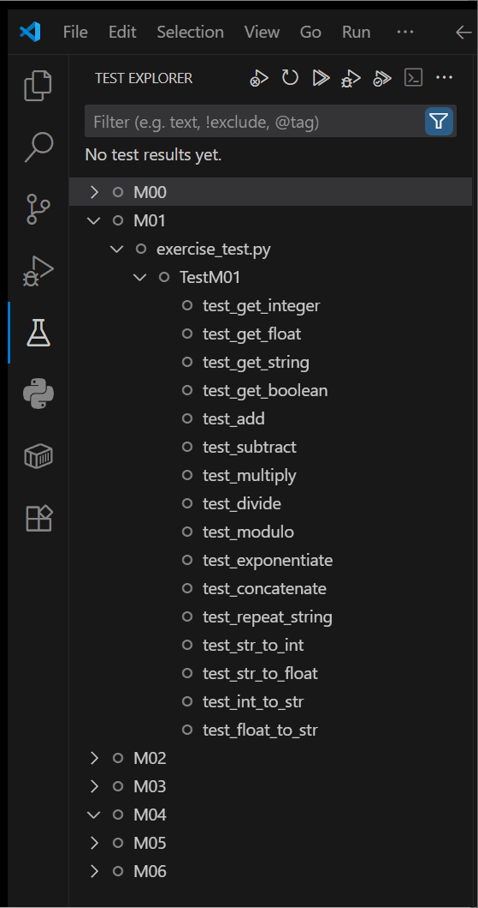
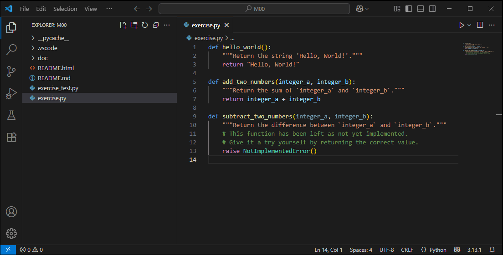
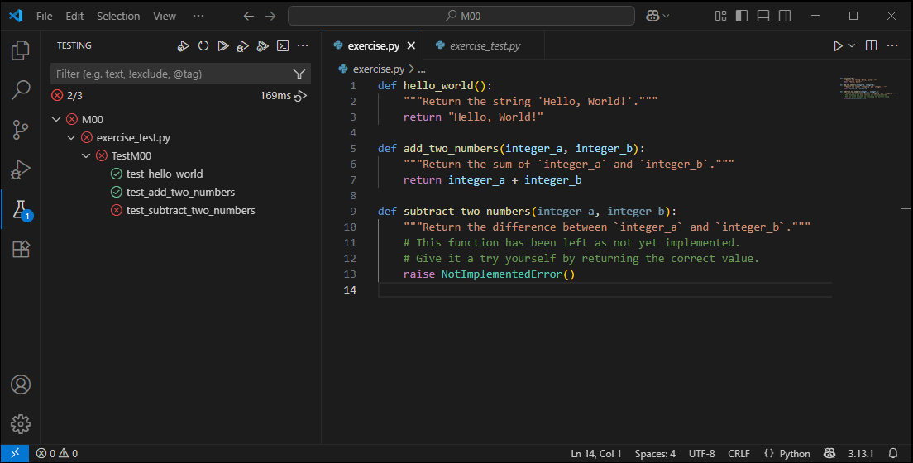

# M00 Unit Exercise: Getting Started
Welcome to your first unit exercise!
This will be a primer that explains how these exercises work and how to complete them successfully.

These exercises are focused coding challenges designed to help you practice one or more specific Python concepts.
The goal is to practice writing clear, correct code for each concept, such as working with variables, performing arithmetic, or manipulating strings and arrays.
Each exercise is broken down into simple challenges so you can concentrate on learning one skill at a time.

These exercises use **unit testing** to automatically verify your code for correctness.
When all the tests pass, you’ll know you’ve provided a correct solution.

Here is a general outline of steps you will follow:
1. Read the lesson material on Canvas.
2. Download and open the provided exercise files in your code editor.
3. Complete each challenge in `exercise.py`.
4. Run the unit tests in VS Code or on the command line.
5. Fix any errors and repeat until all tests pass.
6. Submit your `exercise.py` assignment file.

---

## What are these files?
Each Python project exercise will contain three important files:
- **`README.md`**:
   This is the file you are reading now.
   A *README* file explains important details about a project.
- **`exercise.py`**:
   This file contains a series of Python function definitions.
   Each challenge function will be intentionally incomplete.
   Your job is to fill in the correct code for each function so that it works as described in its doc-string.
   You may add new functions and variables as you see fit, but **do not modify the existing function definitions**.
- **`exercise_test.py`**:
   This file contains automated unit tests for every function in `exercise.py`.
   These tests check if your code works as expected.
   **Do not modify this file.**

---

<div style="page-break-after:always;">See next page...</div>


## What is unit testing?


Unit testing is a standard tool in professional programming used to prove that a piece of code works as intended.
In simple terms, it automatically checks that your code correct.

For each function in `exercise.py`, there is a corresponding unit test in `exercise_test.py` that runs your code with sample inputs and checks the output.

Understanding if a unit test has passed or failed it easy:
- :white_check_mark: If your code correct, you’ll see a green check mark.
- :x: If your code is incorrect, you’ll see a red X mark and an error message explaining what went wrong.

Unit tests give instant feedback and proof that your code works.
It will reveal where your code works, and where it needs improvement.
This feedback will help build confidence in your coding skills.


### Do I Need to understand unit tests or functions yet?
**No!**
You do **not** need to understand how unit tests work, how to write them, or even how functions work (yet).
Just think of each function in `exercise.py` as a "fill in the blank" challenge.
The unit tests will automatically check your answers and let you know if you got it right without needing to know how they work.

<div style="clear:right;">

---

<div style="page-break-after:always;">See next page...</div>


## What do I do?
The following sections provide steps to complete this assignment.


### 1. **Read the lesson material**
Start by reading the relevant lesson material for this week's module on Canvas.
Lesson material contains explanations and examples of all the Python concepts you need for this assignment.


### 2. **Open the exercise file**
Open [`exercise.py`](exercise.py) in your editor (VS Code recommended, but any editor works).



### 3. **Implement each function**
For every function in `exercise.py`, replace `raise NotImplementedError()` with working Python code that matches the requirements described in the doc-string.
- Each function should only do what its doc-string says.
- Use only Python features covered in the lesson.


#### Example 1
Each challenge starts with the word `def` followed by a word that labels the definition block.
The definition block's label will often tell you what the challenge might ask of you.

The next line will include instructions for the challenge wrapping in tripple double-quotes `"""`.
This is known as the *doc-string* which stands for *documentation string* which will tell you what to do.

Last is the `raise NotImplementedError()` line.
This line indicates that you have not provided a solution yet.
Delete this line and replace it with your proposed solution.
```python
def get_true():
   """Return a `True` boolean value."""
   raise NotImplementedError()
```

This challenge asks you to `return` a `True` literal boolean value.
Your job is to replace `raise NotImplementedError()` with a line that returns the value described in the doc-string.

For our purposes, consider the `return` keyword as how you "submit" your solution when the challenge asks you to give it the value of some kind.

```python
def get_true():
   """Return a `True` boolean value."""
   return True
```


#### Example 2
This challenge asks you to `return` the literal integer value of `42`.
```python
def get_integer():
   """Return the integer value `42`."""
   raise NotImplementedError()
```

Now we delete the `raise NotImplementedError()` line and replace it with a line that returns a:
```python
def get_integer():
   """Return the integer value `42`."""
   return 42
```


#### Example 3
Here is a slightly more advanced example:
```python
def sum_of_even(numbers):
   """Return the sum of all *even* numbers in the given `list` of numbers."""
   raise NotImplementedError()
```

After you fill in the challenge code, it might look like this:
```python
def sum_of_even(numbers):
   """Return the sum of all *even* numbers in the given `list` of numbers."""
   total = 0
   for number in numbers:
      if number % 2 == 0:
         total += number
   return total
```

---

<div style="page-break-after:always;">See next page...</div>


### 4. **Test your code**
The exercise tests can be run in the VS Code Test Explorer or on the command line.

Using the VS Code Test Explorer is recommended for it's helpful user interface.
You will know your code is correct when all the unit tests pass with a green check mark :white_check_mark:.


#### Option 1: Using VS Code (Recommended)
1. Open the folder in VS Code.
2. Make sure you have the Python extension installed.
3. Open the **Testing** sidebar (beaker icon).
4. Click **Run All Tests**.
5. :white_check_mark: Green check marks mean your code is correct!
   - :x: If you see red Xs, click on them to see which test failed and why.




#### Option 2: Using the Command Line
1. Open a terminal in the project folder.
2. Run:
   ```shell
   python -m unittest exercise_test.py
   ```
3. If all tests pass, you will see something like:
   ```
   Ran 17 tests in 0.001s

   OK
   ```
- If a test fails, you will see an error message telling you which function needs fixing.

---

<div style="page-break-after:always;">See next page...</div>


### 5. **Submit your code**
Submit only your `exercise.py` file and a screenshot of your passing tests to Canvas.


**That’s it!**
Don’t worry about the meaning of `def`, parentheses, or anything else for now.
Just focus on making each function `return` the correct value.

The unit tests will automatically check your answers and let you know if you got it right.
You’ll learn more about functions and testing in later modules.
Right now, just treat each function as a blank to fill in.

---

## Tips for Success
- **Do not modify `exercise_test.py` or change function definitions in `exercise.py`.**
- - You may add new functions and variables to `exercise.py` if your solution demands it.
- Work on one function at a time, then run the tests to check your progress.
- If you're stuck, reread the lesson or ask for help.
- Your goal: All green check marks in the test results!

## Troubleshooting Tips
- If tests don’t run, make sure Python is installed and you’re in the correct folder.
- If you see import errors, check that your files are named correctly and in the same folder.
- It is normal to get stuck! Ask for help or post in discussion forums after you have made an effort.

---

Good luck, and have fun coding!
